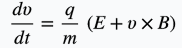
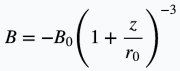
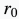
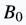
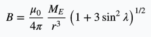
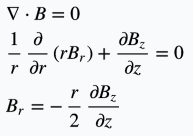
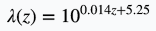
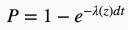

# about simulation code
## equation of motion
Equation of motion in this simulation is as below.

## parameters
Parameters in this simulation is as below

|parameter|value|
|:--:|:--:|
|initial altitude [km]|300|
|magnetic latitude [°]|66|
|electric field|0|
|magnetic field|detail is as below|
|energy of particle(electron) [keV]|1|
|mirror force|with／ignore|
|initial pitch angle [°]|0-90|
|width of time [s]|3.07 ×  10^(-8)|
|time step [times]|2.0 ×  10^7|
|collision probability|detail is as below|

### magnetic field

: Earth radius

: magnitude of magnetic field at Earth's surface

##### [reference] _BasicSpacePlasmaPhysics, p32, eq3.1_
equation of dipole field is

##### [reference] _Katoh and Omura, JGR 2006_
In this simulation, divergence of magnetic field 0

### about collision probability
Collicion probability is refered to collision frequency _BasicSpacePlasmaPhysics,p.66_

number of collision during cyclotron period, λ

When collision occurs according to exponential distribution,
collision probability, P per 1 step in this simulation is as

### about normalization
In this simulation, parameters are normalized.

| parameter | unit |
|:----------:|:---:|
|velocity|c|
|time|Ω^(-1)|
|distance|cΩ^(-1)|
|mass|m\_e|
|charge|q\_e|

c: speed of light,
Ω: cyclotron period,
m\_e: mass of electron,
q\_e: charge of electron

In this simulation, Ω is at Earth's surface.
