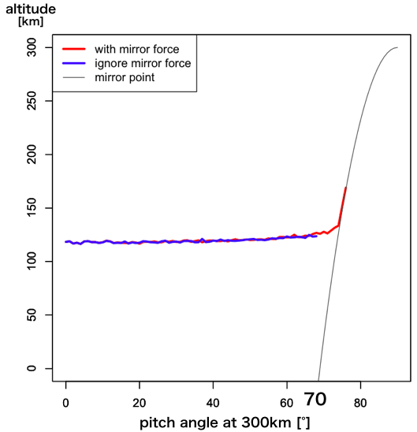
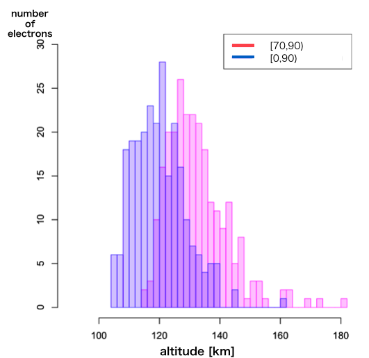

## Abstract

Pulsating auroras(PsA) emits light by electrons precipitating to Earth's ionosphere.

The electrons can precipitate to Earth's ionosphere by receiving pitch angle scattering by a plasma wave near equatorial plane of Earth's magnetosphere.

In addition, PsA is the aurora with optical pulsations.

The precipitated electrons are known to reach lower altitude as PsA more strongly emits light. _[Hosokawa and Ogawa, 2015]_

It is because that the precipitated electrons with high enegy can reach lower altitude._[Rees, 1963; Trunen et al., 2009]_

On the other hand, the precipitated electrons recieve mirror force by space change of the background magnetic field strength, and its pitch angle changes according to the altitude.

the electron with the pitch angle around loss cone angle might be strongly affected by that.

In the past study, the effect that mirror force gives to arrival attitude of the precipitated electrons.

Thus, the purpose of this study is to calculate that how long does the change of the pitch angle affects the arrival attitude of the precipitated electrons.

Therefore we made the simulation code of the single particle and excuted it.

First, we calculated the collision altitude every initial pitch angle with mirror force or not.

By the electrons with initial pitch angle of 0-60 degree the collision altitude doesn't change with mirror force or not.

Then as initial pitch angle is more than 70 degree we obtained the result that the collision altitude with mirror force is about 10-20km higher than it without mirror force.

Next, we calculated the collision altitude with mirror force changing initial pitch angle distribution

We calculated about initial pitch angle distribution of uniform distribution, [0, 90) and [70, 90).

We obtained the result that the collirion altitude with uniform distribution [70, 90) is about 20km higher than it with uniform distribution [0, 90).

From the above we obtained the precipitated electron's collision altitude in detail by excuting the simulation of the single particle with mirror force.

And we obtained the change of the collision altitude by the change of initial pitch angle.

## Introduction
#### About motion of plasma particles at Earth's magnetosphere

In Earth's magnetosphere, the plasma particles do cyclotron motion along a magnetic field line and do mirror motion by recieving mirror force resulting the space change of the magnetic field.

Then the angle made from a speed vector of the particle and a magnetic field line is called a pitch angle.

As the first adiabatic invariant is stored for the mirror motion, the speed vector of the plasma particle doesn't change and the pitch angle only changes.

The pitch angle of the particle reaching Earth's ionosphere is calld a loss cone angle.

Also loss cone is the tetrahedron that is made from the loss cone angle.

And the plasma particle with the pitch angle included in the loss cone can reach Earth's ionosphere.

#### Pulsating aurora(PsA)
Pulsating auroras(PsAs) are the diffuse aurora and pulse optically with a period of a few to few tens of seconds.

PsA emits lights by the precipitated electrons with a few to few tens of energies that recieved wave particle interaction in the magnetosphere and reached the ionosphere.

Also there is known to be a difference from about 10-20km in the altitude distribution that electrons exist by the optically pulse of the PsA. _[Hosokawa and Ogawa, 2015]_

## Purpose of this sutdy
In the past studies, the influence that mirror force gives to preticipated particles isn't considered enough.

Then in this study, executing the simulation of a preticipated particle with mirror force, we calcurate how long the change of the pitch angle influences the altitude of preticipated particles.

## Summary of this simulation code
This is simulation of single particle at Earth's ionosphere.

particles collide with atmospheric atom molecules with constant probability.
(Once if particles collide, calculation is finished.)

At first, we calcurated the change of collision altitude with or ignoring mirror force.

Next we calurated the change of collision altitude by the change of the pitch angle distribution.

Please see [About this simulation](./about_simulation.md) for the details.

## Result
####1. Collision altitude with or without mirror force

We executed simulation to calcurate mean of collision altitude by 100 times every each 1 degree assumede initial pitch angle of 0-90 degrees.

Then the upper graph is the result of the simulation.

In the graph, the red line is a plot with mirror force, the blue line is a plot ignoring mirror force, and the gray line is aplot of mirror point

From this graph, as initial pitch angle is 0-60°, collision altitude is about 120km regardless of whether mirror force.

And collision altitude without mirror force doesn't change by initial pitch angle.

Here the reason why data more than about 65 degrees aren't plotted in the blue line is that collision altitude lowered than mirror point onthe theory.

Furthermore, collision altitude rose by around 70 degrees with mirror force and it agrees with mirror point.

from this result, collision altitude changes by initial pitch angle regardless of whether mirror force.

Then we calculated change of collision altitude varing initial pitch angle distribution with mirror force.

####2. Change of collision altitude by various pitch angle distribution

The upper graph is a plot of collision altitude generated 1,000 electrons by initial pitch angle distribution as normal distribution of [0, 90) and [70, 90)

In addition, the following lists showed mean and standard deviation of collision altitude by each pitch angle distribution.

|-|[0, 90)|[70, 90)|
|:--:|:--:|:--:|
|mean [km]|132.4|112|
|sd|10.29|8.71|

We found that when initial pitch angle distribution is uniform distriburion [0, 90) or [70, 90), collision altitude of distribution [70, 90) is about 20km higher than it of [0, 90).

## Summary
We made simulation code of motion that electron collides with atomic molcule at neutral atmmosphere in Earth's ionosphere

Using the simulation, we revealed that collision altitude of electron with mirror force gets lower than it without mirror force.

In addition, we revealed that pitch angle distribution changes collision altitude of electron too.

## Consideration
#### about change of collision altitude whether mirror force is ignored
Ignoring mirror force, magnetic force direction velocity doesn't change as pitch angle doesn't change.

With mirror force, as particle reaches mirror point pitch angle gets closer to 90 degree and magnitude of magnetic force direction velocity gets smaller.

Then particles come to stay near mirror point.

Based on these factor, I supposed more collisions happen with mirror force than ignoring it.
