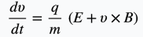
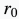
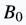
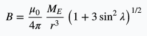
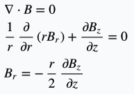
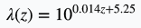
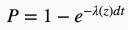

## シミュレーションコードの詳細
#### 運動方程式
今回本コードで用いた運動方程式は以下。

#### パラメータ
与えるべきパラメータと、このコードで与えた値は以下。

#####1. 運動方程式
|パラメータ名|値|
|:--:|:--:|
|初期高度 [km]|300|
|磁気緯度 [°]|66|
|電場|0|
|磁場|以下に詳細|
|エネルギー [keV]|1|
|mirror force|有／無|
|ピッチ角 [°]|0-90|
|時間の幅 [s]|3.07 ×  10^(-8)|
|time step [回]|2.0 ×  10^7|
|衝突確率|以下に詳細|

###### 磁場の決め方
磁場は、双極子磁場を想定して、近似しています。

: 地球半径
: 地球表面での磁場の大きさ

[参考] _BasicSpacePlasmaPhysics,p32_
双極子磁場の大きさ

さらに、磁場の発散が0になるようにしています。

[参考] _Katoh and Omura, JGR 2006_

###### 衝突確率の決め方
 衝突確率は、_BasicSpacePlasmaPhysics,p.66_の衝突周波数のグラフを参考に作られています。

 まず75kmを基準として、1サイクロトロン周期での衝突回数の平均(ポアソン分布)を近似すると、

 この衝突が指数分布にしたがって起きるとすると、
シミュレーション1stepあたりの衝突確率Pは、

となります。

##### 規格化について
このシミュレーションでは、規格化をしています。
それぞれのパラメータは以下の単位になっています。

| パラメータ名 | 単位 |
|:----------:|:---:|
|速度|c^(-1)|
|時間|Ω^(-1)|
|距離|cΩ^(-1)|
|質量|m_e^(-1)|
|電荷|q_e^(-1)|

ここで、cは光速、
Ωはサイクロトロン周期
m_e 電子の質量
q_e 電子の電荷です。

また、このシミュレーションでΩは地表での値入れています。
