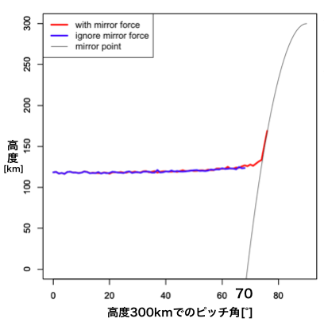

## abstract
脈動オーロラは、磁気圏においてプラズマ波動によりピッチ角散乱を受けた電子が電離圏まで降下することで発光する。
脈動オーロラが発光している時、そのもととなる電子は、脈動オーロラの未発光時よりも電離圏のより低高度まで降下していることが知られている。その原因は、高いエネルギーを持つ電子が降込む時には、より低高度まで到達する[Rees, 1963; Trunen et al., 2009]ことで説明されている[Hosokawa and Ogawa, 2015]。
一方で、電離圏に降込む電子は、背景磁場強度の空間変化によるmirror forceを受けるため、高度に応じてピッチ角が変化する。ロスコーン付近の電子は特にこの影響が大きくなると考えられる。従来の研究では、mirror forceが降込み電子の到達高度に及ぼす影響については、十分に考慮されていなかった。よって本研究の目的は、ミラー力を考慮した粒子シュミレーションのコードを作成し、ピッチ角の変化が電子の降下の高度にどれくらい影響するのかを計算することになる。
計算結果は以下の通り。まずmirror forceを考慮する時としない時で初期ピッチ角ごとの衝突高度を比較する。初期ピッチ角0-60°の電子ではmirror forceの有無により衝突高度に差はなかった。しかし、初期ピッチ角が70°以上になると、mirror forceを考慮しない時はほとんど衝突高度が変わらないのに対し、mirror forceを考慮するときは衝突高度が10-20kmほど高くなるという結果が得られた。
次に、mirror forceを考慮した上で、初期ピッチ角分布を変化させて衝突高度を比較する。今回比較した初期ピッチ角分布は、[0, 90)の一様分布と[70, 90)の一様分布である。結果は、[70, 90)の一様分布の方が20kmほど衝突高度が高くなることがわかった。
よって、本研究ではmirror forceを考慮した電離圏高度での粒子シミュレーションを行うことで、電子の本来の衝突高度を明らかにし、さらに初期ピッチ角分布の変化によっても衝突高度が変化することも明らかにした。

## introduction
#### 磁気圏でのプラズマ粒子の運動
地球の磁気圏では、プラズマ粒子は磁力線に沿ってサイクロトロン運動しながら、磁場の空間変化によって生じる力(mirror force)を受けて、mirror pointで折り返すミラー運動をしている。
このとき、粒子の速度ベクトルと磁力線のなす角をピッチ角という。

また、ミラー運動中で第一不変量が保存されているので、プラズマ粒子の速度ベクトルの大きさは変わらず、ピッチ角の大きさのみ変わっていく。

電離圏高度まで達するときの赤道平面でのピッチ角をロスコーン角と呼ぶ。
ロスコーンは、このロスコーン角から作られる三角錐で、この領域に入るピッチ角をもつプラズマ粒子は電離圏高度まで達することができる。

#### 脈動オーロラ
ディフューズなオーロラで、数秒から数十秒の周期で点滅している。
脈動オーロラは、数keVから数十keVの電子が磁気圏で波動粒子相互作用をうけて、電離圏まで到達することにより発光する。
また、脈動オーロラの点滅の明滅(ON,OFF)時では、それぞれ電子の存在する高度分布に約10から20kmの差があることが知られている。_[Hosokawa and Ogawa, 2015]_

## 研究の目的
従来の研究では、ミラー力が降込み電子の到達高度に及ぼす影響について十分に考慮されていなかった。本研究では、ミラー力を考慮した粒子シュミレーションを行うことで、ピッチ角の変化が電子の降下の高度にどれくらい影響するのかを計算する。

## シミュレーションコードの概要
電離圏での単一電子の運動のシミュレーション。
電子は一定の確率で中性大気中の原子分子と衝突(計算終了)。
まずはmirror forceの有無よる衝突高度の変化を調べ、
次にピッチ角分布の変化による衝突高度の変化をみる。
詳細は、[シミュレーションコードの詳細]()をご覧ください。

## 結果
####1. mirror force有/無での衝突高度

上のグラフは、高度300kmでのピッチ角(初期ピッチ角)を0-90°とし、それぞれ1度ごとに100回ずつシュミレーションを行って衝突高度の平均をプロットしたものである。
赤い線は、mirror forceを考慮した時のプロットで、青い線は、mirror forceを考慮しない時のプロットである。また、灰色の線は、mirror pointのプロットである。

このグラフより、ピッチ角0-60°の電子は、mirror forceの有無にかかわらず衝突高度が120km付近であることが分かる。
また、mirror forceを考慮しない時は初期ピッチ角により衝突高度は変化しないことも分かる。ここで、青線の約65°以上のデータがプロットされていないのは、衝突高度が理論上でのmirror pointよりも低くなったからである。
さらに、mirror forceを考慮すると、70°付近で衝突高度が高くなることがわかった。また、それはmirror pointに一致していることもグラフから読み取れる。

この結果から、mirror forceの有無により、初期ピッチ角ごとに衝突高度が変化することがわかった
よって、mirror forceを考慮した上で、初期ピッチ角分布を変化させ、衝突高度がどのように変化するのかを調べる。

####2. 異なるピッチ角分布での衝突高度の変化

上のグラフは、初期ピッチ角分布を[0,90)の一様分布と[70, 90)の一様分布で、それぞれ電子を1000個ずつ生成し、衝突高度をプロットしたものである。

また、以下の表はそれぞれのピッチ角分布での衝突高度の平均と、標準偏差を示したものである。

|／|[0, 90)|[70, 90)|
|:--:|:--:|:--:|
|平均 [km]|132.4|112|
|標準偏差|10.29|8.71|

これらより、初期ピッチ角分布が[0, 90)の一様分布と[70, 90)の一様分布では、[70,90)の分布の方が衝突高度の平均が約20kmほど高くなることがわかった。

## まとめ
地球の電離圏において、中性大気中の分子と衝突する電子の運動の
シミュレーションコードを作成した。そのシミュレーションを用いて、
mirror forceを考慮する時としない時で、電子の衝突高度に変化があることを明らかにした。さらに、ピッチ角分布の変化のよる衝突高度の変化も明らかにした。

## 考察
#### mirror forceの有無による衝突高度の変化について
mirror forceを考慮しないときは、ピッチ角が変化しないので、電子の磁力線方向の速度の大きさは変化しない。
mirror forceを考慮すると、mirror pointに近づくにつれて、ピッチ角が90°に近づいていき、電子の磁力線方向の速度の大きさはだんだんと小さくなっていく。
よって、mirror forceを考慮すると電子はmirror point付近にとどまりやすくなり、考慮しない時よりも、mirror point付近で衝突しやすくなるのではないか、と考える。
